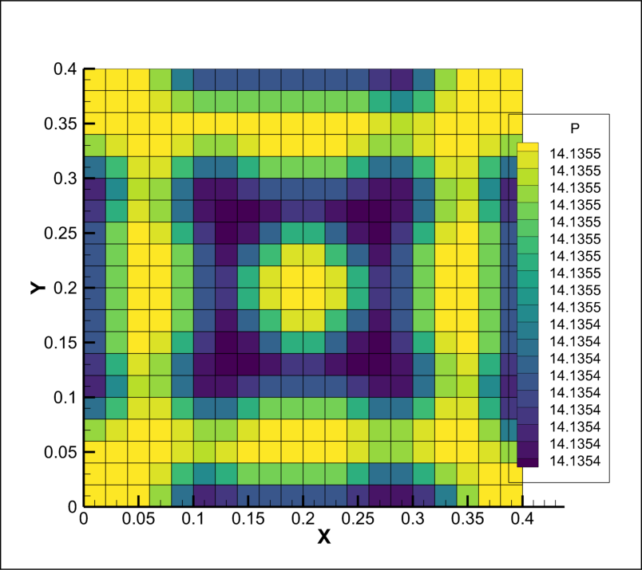
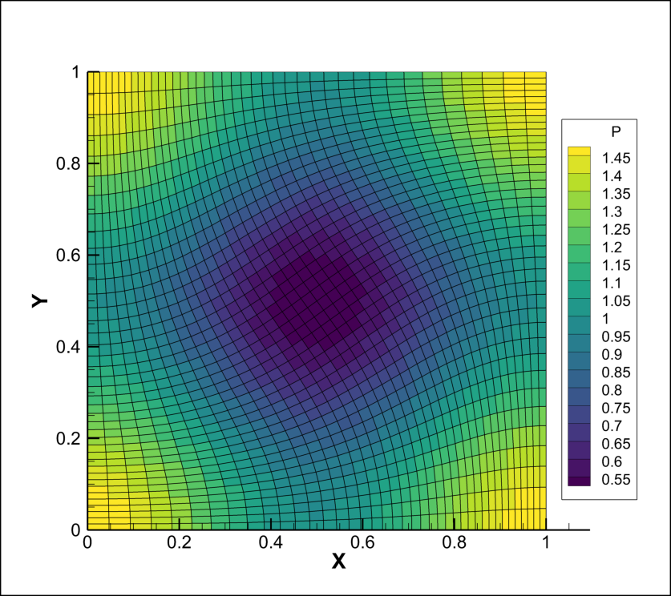
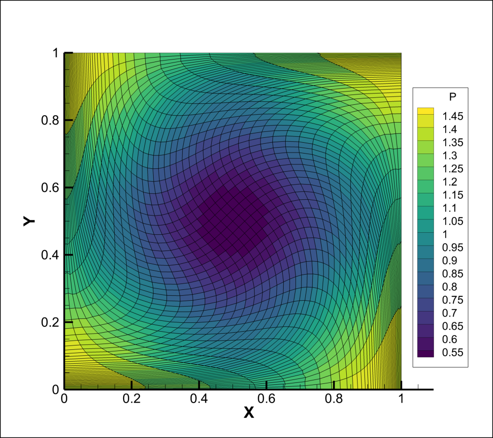
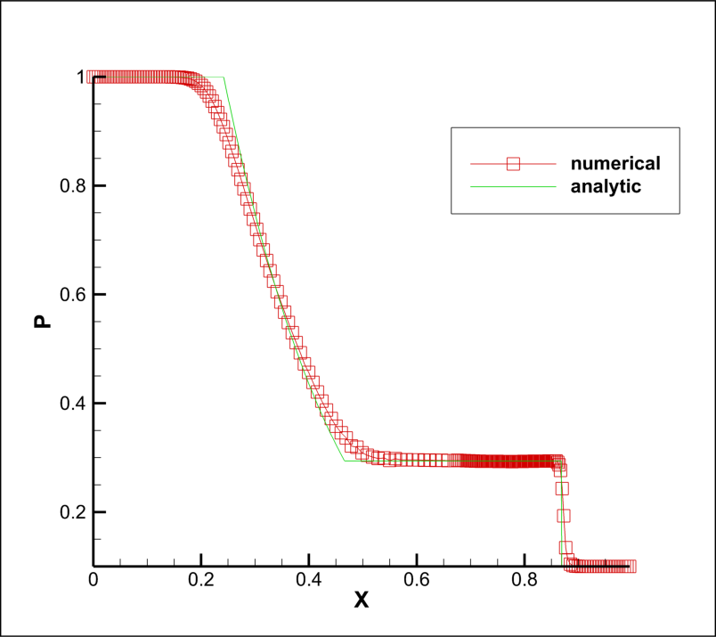
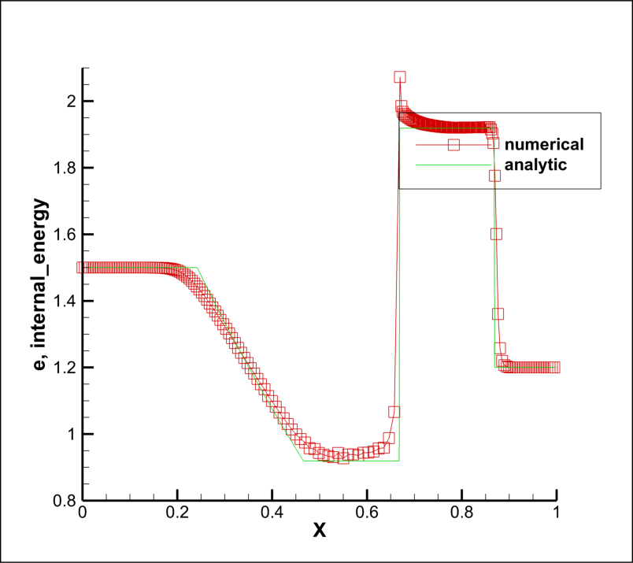
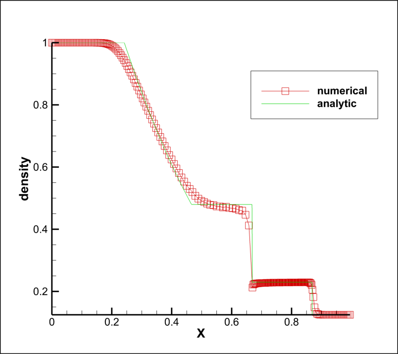
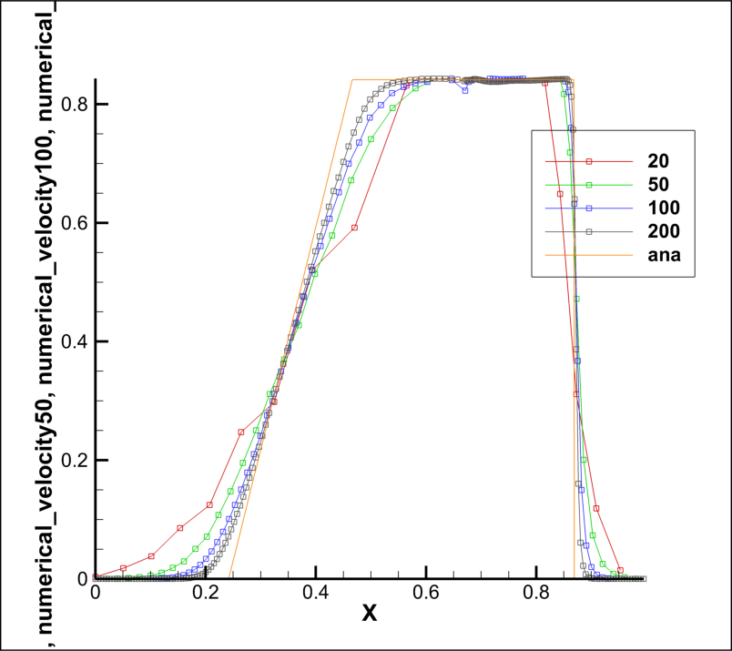
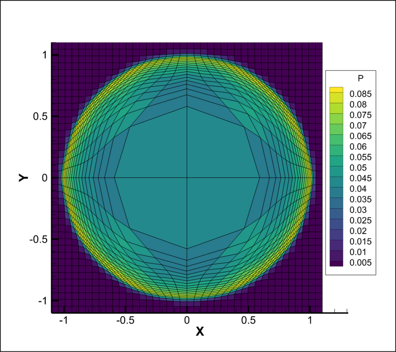
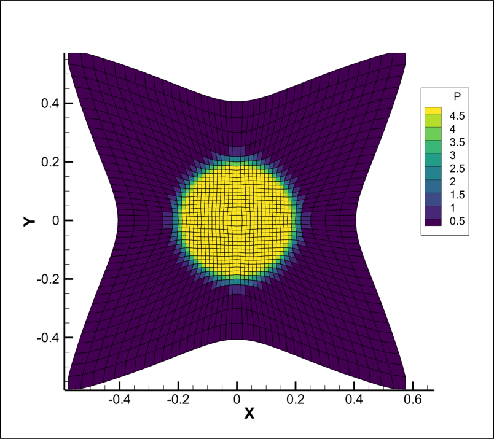

# A Lagrangian DG hyperdynamic method

***Xiaodong Liu, Nathaniel R. Morgan, Donald E. Burton***

***

## 控制方程

$$
\begin{equation}
\begin{split}
\frac{d\rho}{dt} & = - \rho \nabla \cdot \textbf{u}\\
\rho \frac{d\textbf{u}}{dt} & = \nabla \cdot \sigma\\
\rho \frac{d\tau}{dt} & = \nabla \cdot (\sigma \cdot \textbf{u})
\end{split}
\end{equation}
$$
其中$\tau = e + k$为质量总能，$\sigma$为应力张量，对理想气体为$\sigma = -p \textbf{I}$。

***

## 离散

$$
\textbf{x} = \sum_p b_p \textbf{x}_p
$$
其中$\textbf{x}_p$为单元的节点坐标，$b_p$为形函数。

$$
\mathbb{U}(\mathbf{\xi},t) = \mathbf{\psi}(\xi) \cdot \mathbb{U}^k(t)\\
\mathbb{U} = [\mathbb{U}_{cm}, \frac{\partial \mathbb{U}}{\partial \xi}_{cm}, \frac{\partial \mathbb{U}}{\partial \eta}_{cm}]^T\\
\psi = [1, \xi - \xi_{cm}, \eta - \eta_{cm}]^T
$$

### 质量守恒

$$
\rho(\xi,t) |J| (\xi,t) = \rho^0(\xi) |J|(\xi,t^0)
$$

> *如果初始密度有间断需要特殊处理：积分点可能会落在间断的地方，用强质量守恒会出现问题。如果初始密度没有间断不需要特别处理*

### 时间积分

$$
(\mathbb{U}^k)^{s1} = (\mathbb{U}^k)^n + \Delta t M^{-1} \cdot \mathbb{R}^n\\
(\mathbb{U}^k)^{n+1} = \frac{1}{2}(\mathbb{U}^k)^n + \frac{1}{2}(\mathbb{U}^k)^{s1} + \frac{1}{2}\Delta t M^{-1} \cdot \mathbb{R}^{s1}
$$

$$
(\textbf{x}_p)^{s1} = (\textbf{x}_p)^n + \Delta t \cdot (\textbf{u}_p^*)^n\\
(\textbf{x}_p)^{n+1} = \frac{1}{2}(\textbf{x}_p)^n + \frac{1}{2}(\textbf{x}_p)^{s1} + \frac{1}{2}\Delta t \cdot (\textbf{u}_p^*)^{s1}
$$

### 动量守恒离散

$$
\begin{split}
& \left[
\begin{array}{ccc}
m & 0 & 0\\
0 &  \sum_{g\in \Omega} (\rho \psi_2 \psi_2)_g |J|_g \Omega_g &  \sum_{g\in \Omega} (\rho \psi_2 \psi_3)_g |J|_g \Omega_g\\
0 & \sum_{g\in \Omega} (\rho \psi_3 \psi_2)_g |J|_g \Omega_g &  \sum_{g\in \Omega} (\rho \psi_3 \psi_3)_g |J|_g \Omega_g
\end{array}
\right] \cdot \frac{\Delta}{\Delta t}
\left[
\begin{array}{c}
\textbf{u}_{cm}\\
\frac{\partial \textbf{u}}{\partial \xi}_{cm}\\
\frac{\partial \textbf{u}}{\partial \eta}_{cm}
\end{array}
\right]\\
& = \left[
\begin{array}{c}
\sum_{i\in \omega(t)} a_i \textbf{n}_i \cdot \sigma^*_c\\
\sum_{i\in \omega(t)} \psi_{2_p} a_i \textbf{n}_i \cdot \sigma^*_c\\
\sum_{i\in \omega(t)} \psi_{3_p} a_i \textbf{n}_i \cdot \sigma^*_c
\end{array}
\right] - \left[
\begin{array}{c}
0\\
\sum_{g \in \Omega} (\nabla_\xi \psi_2 \cdot |J| J^{-1} \cdot \sigma )_g \Omega_g\\
\sum_{g \in \Omega} (\nabla_\xi \psi_3 \cdot |J| J^{-1} \cdot \sigma )_g \Omega_g
\end{array}
\right]
\end{split}
$$

### 能量守恒离散

$$
\begin{split}
& \left[
\begin{array}{ccc}
m & 0 & 0\\
0 &  \sum_{g\in \Omega} (\rho \psi_2 \psi_2)_g |J|_g \Omega_g &  \sum_{g\in \Omega} (\rho \psi_2 \psi_3)_g |J|_g \Omega_g\\
0 & \sum_{g\in \Omega} (\rho \psi_3 \psi_2)_g |J|_g \Omega_g &  \sum_{g\in \Omega} (\rho \psi_3 \psi_3)_g |J|_g \Omega_g
\end{array}
\right] \cdot \frac{\Delta}{\Delta t}
\left[
\begin{array}{c}
\tau_{cm}\\
\frac{\partial \tau}{\partial \xi}_{cm}\\
\frac{\partial \tau}{\partial \eta}_{cm}
\end{array}
\right]\\
& = \left[
\begin{array}{c}
\sum_{i\in \omega(t)} a_i \textbf{n}_i \cdot \sigma^*_c \cdot \textbf{u}_p^*\\
\sum_{i\in \omega(t)} \psi_{2_p} a_i \textbf{n}_i \cdot \sigma^*_c \cdot \textbf{u}_p^*\\
\sum_{i\in \omega(t)} \psi_{3_p} a_i \textbf{n}_i \cdot \sigma^*_c \cdot \textbf{u}_p^*
\end{array}
\right] - \left[
\begin{array}{c}
0\\
\sum_{g \in \Omega} (\nabla_\xi \psi_2 \cdot |J| J^{-1} \cdot \sigma \cdot \textbf{u})_g \Omega_g\\
\sum_{g \in \Omega} (\nabla_\xi \psi_3 \cdot |J| J^{-1} \cdot \sigma \cdot \textbf{u})_g \Omega_g
\end{array}
\right]
\end{split}
$$

***

## Riemann问题

$$
\textbf{F}_i^* =  a_i \textbf{n}_i \cdot \sigma_c^* = a_i \textbf{n}_i \cdot \sigma_c + \mu_c |\textbf{n}_i \cdot \textbf{e}_c| a_i (\textbf{u}_p^* - \textbf{u}_c)
$$

其中$\textbf{e}_c = \frac{\textbf{u}_p^*- \textbf{u}_c}{\Vert \textbf{u}_p^* - \textbf{u}_c \rVert}$，因为$\textbf{u}_p^*$暂时不知道，所以用$\hat{\textbf{e}}_c = \frac{\textbf{u}_p^{avg}- \textbf{u}_c}{\lVert \textbf{u}_p^{avg} - \textbf{u}_c \rVert}$代替，$\textbf{u}_p^{avg}$为$\textbf{u}_c$的平均。

$$
\textbf{u}_p^* = \frac{\sum_{i \in p} \mu_c |\textbf{n}_i \cdot \hat{\textbf{e}}_c| a_i \textbf{u}_c - a_i \textbf{n}_i \sigma_c}{\sum_{i \in p}\mu_c |\textbf{n}_i \cdot \hat{\textbf{e}}_c|a_i}
$$

> *因为满足动量守恒的充分条件是$\sum_i \textbf{F}^*_i = 0$，所以$\textbf{F}^*_i$计算中的$\textbf{e}_c$也要用$\hat{\textbf{e}}_c$代替*
> $\sigma_c$在节点处取值，$\mu_c$在单元中心取值

***

## 限制器

$\mathbb{U}^{lim}(\xi_p) = \overline{\mathbb{U}} + \phi (\mathbb{U}(\xi_p) - \overline{U})$

其中
$\phi = 
\begin{cases}
\min(1,\frac{\alpha (\overline{\mathbb{U}}^{max}-\overline{\mathbb{U}})}{\mathbb{U}(\xi_p)-\overline{\mathbb{U}}}) \quad \mathbb{U}(\xi_p) > \overline{\mathbb{U}}\\
\min(1,\frac{\alpha (\overline{\mathbb{U}}^{min}-\overline{\mathbb{U}})}{\mathbb{U}(\xi_p)-\overline{\mathbb{U}}}) \quad \mathbb{U}(\xi_p) < \overline{\mathbb{U}}\\
1 \quad else
\end{cases}
$

***

## 算法

**此算法中没有添加限制器*

> **t=0时**
>
>> + 定义网格和初值
>> + 计算单元质心和质量矩阵
>
> **$t_n$时**
>
>> + 计算节点速度$\textbf{u}_p^*$ （基于$\mathbb{U}^n$和$\textbf{x}_p^n$)
>> + 更新物理坐标$(\textbf{x}_p)^{s1} = (\textbf{x}_p)^n + \Delta t \cdot (\textbf{u}_p^*)^n$，同时更新其他几何量
>> + RK第一步，$(\mathbb{U}^k)^{s1} = (\mathbb{U}^k)^n + \Delta t M^{-1} \cdot \mathbb{R}^n$
>> + 计算$(\textbf{u}_p^*)^{s1}$ （基于$\mathbb{U}^{s1}$和$\textbf{x}_p^{s1}$）
>> + 更新物理节点坐标$(\textbf{x}_p)^{n+1} = \frac{1}{2}(\textbf{x}_p)^n + \frac{1}{2}(\textbf{x}_p)^{s1} + \frac{1}{2}\Delta t \cdot (\textbf{u}_p^*)^{s1}$，计算其他几何坐标
>> + RK第二步$(\mathbb{U}^k)^{n+1} = \frac{1}{2}(\mathbb{U}^k)^n + \frac{1}{2}(\mathbb{U}^k)^{s1} + \frac{1}{2}\Delta t M^{-1} \cdot \mathbb{R}^{s1}$

***
***
***

## Test problems

***

### Shockless Noh

#### configuration

> $\gamma = 5/3$

Initial condition:

> $\rho^0 = 1$
>
> $u_x^0 = - x^0$
>
> $u_y^0 = - y^0$
>
> $e^0 = 1$

Boundary condition:
> &emsp; velocity of boundary nodes at any time are fixed:
>
> $u_x(x_b) = - x_b^0$, $u_y(y_b) = - y_b^0$

Analytic solution:

> $\rho = \rho^0(1-t)^q$
>
> $u = u^0$
>
> $v = v^0$
>
> $e = e^0(1-t)^{-q(\gamma - 1)}$
>
> $q = 2$

#### numerical result

当$t=0.6$时，内能的误差为：

|mesh          | $L^2$ error | order |
|:--:          |:-----------:|:-----:|
| 5$\times$5   |   4.545e-3  |   -   |
| 10$\times$10 |   1.133e-3  | 2.004 |
| 20$\times$20 |   2.830e-4  | 2.001 |
| 40$\times$40 |   7.072e-5  | 2.001 |
| 80$\times$80 |   1.768e-5  | 2.000 |

压力的图片：

***

### Taylor-Green vortex

#### configuration

> $\gamma = 7/5$

Initial condition:

> $\rho^0 = 1$
>
> $u_x^0 = \sin(\pi x) \cos(\pi y)$
>
> $u_y^0 = - \cos(\pi x) \sin(\pi y)$
>
> $p^0 = \frac{1}{4} [ \cos(2\pi x) + \cos(2\pi y)] + 1$
>
> with a source term in energy equation:
>
> $e_{s} = \frac{\pi}{4 ( \gamma - 1)}[\cos(3\pi x)\cos(\pi y) - \cos(3\pi y) \cos(\pi x)]$

Boundary condition:

> $u_n = 0$

Analytic solution:

> steady

#### numerical results

$t= 0.2$时压力误差为：

|mesh          | $L^2$ error | order |
|:--:          |:-----------:|:-----:|
| 10$\times$10 |   4.286e-2  |   -   |
| 20$\times$20 |   1.265e-2  | 1.760 |
| 40$\times$40 |   3.589e-3  | 1.817 |
| 80$\times$80 |   1.146e-3  | 1.647 |

$t=0.2$时刻$40\times40$网格压力如下：

$t=0.75$时刻$40\times40$网格如下：

之前corner force合力不为0时会导致如下错误：

***

### 1D Sod shock tube

#### configuration

> $\gamma = 5/3$

Initial conditions:

> $(\rho^0, u_x^0, u_y^0, p^0)_L = (1,0,0,1)$
>
> $(\rho^0, u_x^0, u_y^0, p^0)_R = (0.125,0,0,0.1)$

Boundary conditions:

> $u_n = 0$

#### numerical result

> 在这个例子中用了Maire的节点解法器：
> $\textbf{F}^*_{i,maire} = a_i \textbf{n}_i \sigma^*_c = a_i \textbf{n}_i \sigma_c +a_i \mu_c (\textbf{n}_i \otimes \textbf{n}_i) (\textbf{u}_p^* - \textbf{u}_c)$
> 和Burton的区别在于：
> $$\textbf{F}^*_{i,burton} = a_i \textbf{n}_i \sigma^*_c = a_i \textbf{n}_i \sigma_c +a_i \mu_c (\textbf{e}_c \otimes \textbf{e}_c) (\textbf{u}_p^* - \textbf{u}_c)\\
\quad \quad \quad = a_i \textbf{n}_i \sigma_c +a_i \mu_c  \textbf{e}_c |\textbf{u}_p^* - \textbf{u}_c|$$
> Burton解法器在$\textbf{e}_c$中包含了$\textbf{u}_p^*$，且在速度初值都等于0时为得到速度需要对$\textbf{e}_c$做修改，不同修改的方法结果不一样

当$t=0.2$时结果如下：

***

### Sedov blast

#### configuration

>$\gamma = 7/5$

Initial conditions:

> $(\rho^0, u_x^0, u_y^0, p^0) = (1,0,0,10^{-6})$
>
> energy source at the origin:
>
> $p_O = (\gamma - 1)\rho_O \frac{E_O}{V_O}$, $E_O$为释放的总内能，$V_O$为中心几个网格的总体积，假设为0.5

#### numerical result

当$t=1.5$时压力的图像为：

径向密度图像为：
![density]

### Noh

#### configuration

> $\gamma = 5/3$

Initial condition：

> 初始速度为指向中心的单位向量，初始密度恒为1，初始压力为1e-6

boundary condition:

> $p_b \equiv 10^{-6}$

#### numerical results

$t=0.6$时网格压力如下：

